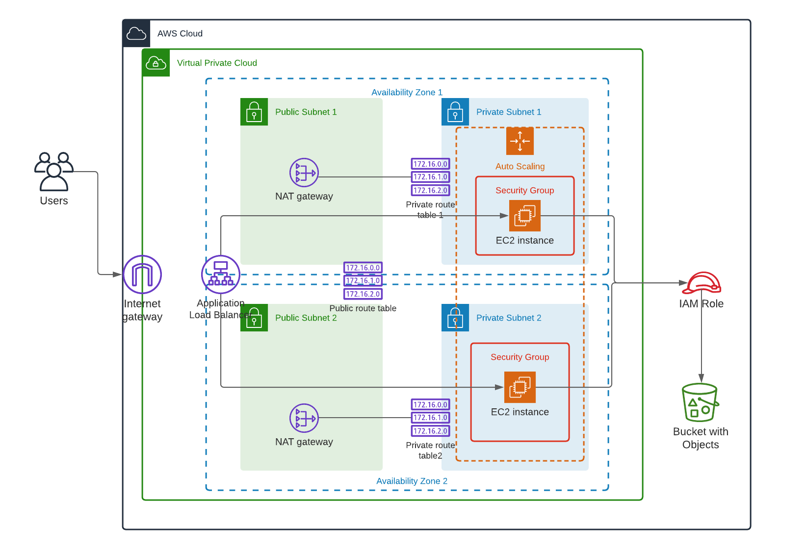

#### Deploy highly available WebApp

In this project, I deployed web servers for a highly available web app using CloudFormation. \
Infrastructure deployment begins with the networking components, followed by servers, security roles and software. The application code is deployed from the S3 bucket using appropriate role.


#### Architecture


#### Requirements
* AWS account profile with appropriate permissions to create resources
* Intalled aws-cli 1.X

#### Usage
**NOTE** : By default script supports creating resources in two regions: the us-east-1 and us-west-2 \
If you wish to launch resources in the different region then you need to update mapping section in the servers.yml template

1. Execute network infrastructure stack
```
./create.sh webapp-network network.yml network-parameters.json
```

2. After step 1 successful completion, execute services infrastructure stack:
```
./create.sh webapp-servers servers.yml server-parameters.json
```

If you want to destroy infrastructure you need to run the following commands:
1. Destroy servers
```
./destroy.sh webapp-servers
```
2. Destroy network
```
./destroy.sh webapp-network
```

#### Output
Stack outputs Public URL of the Load Balancer